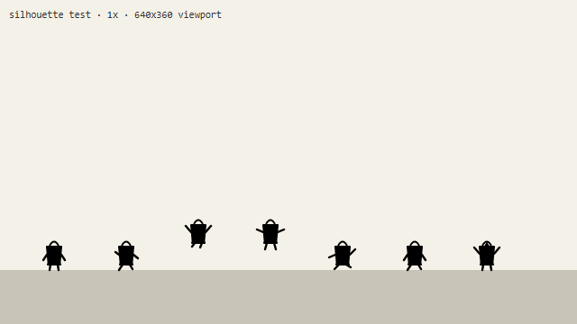
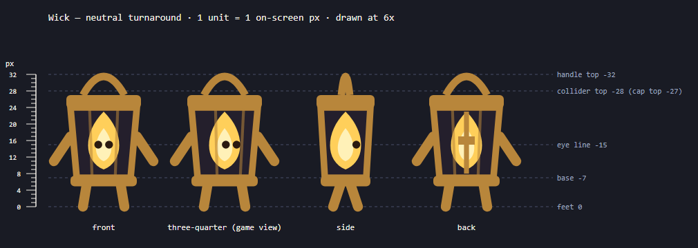
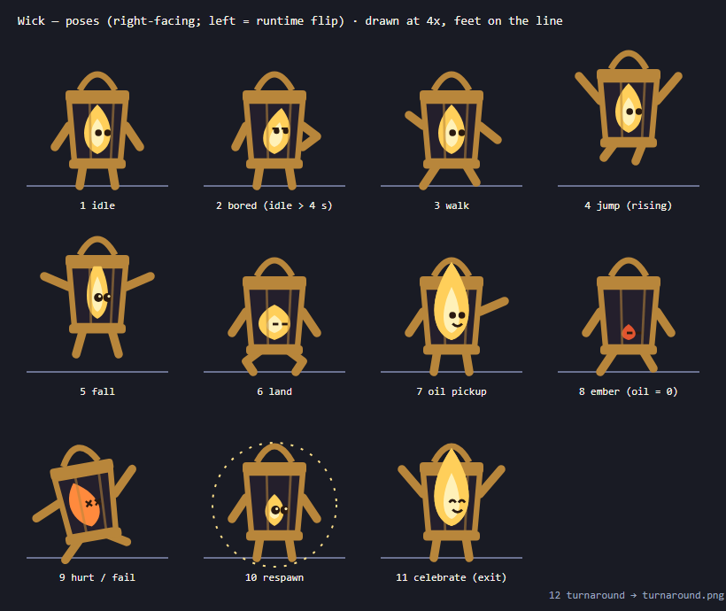
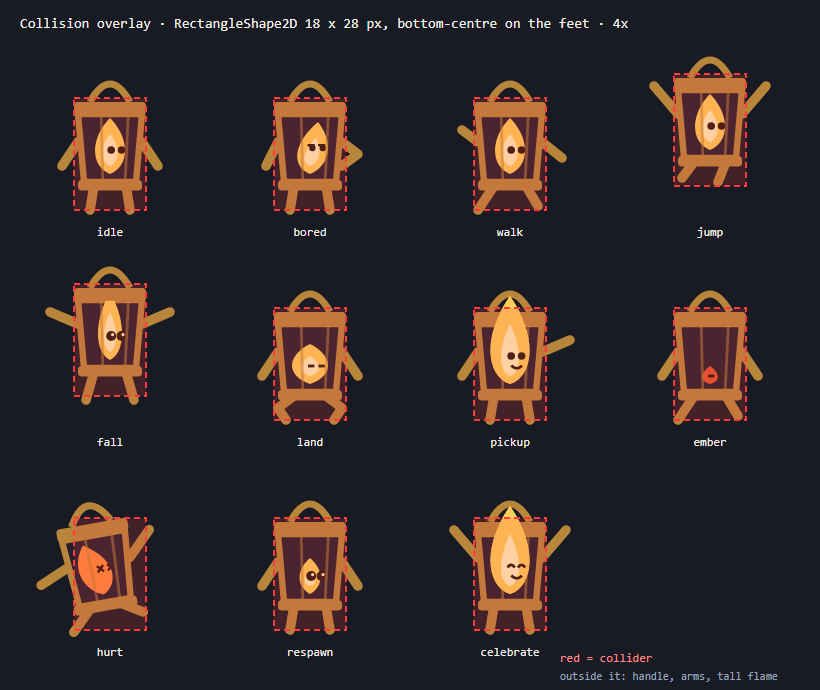
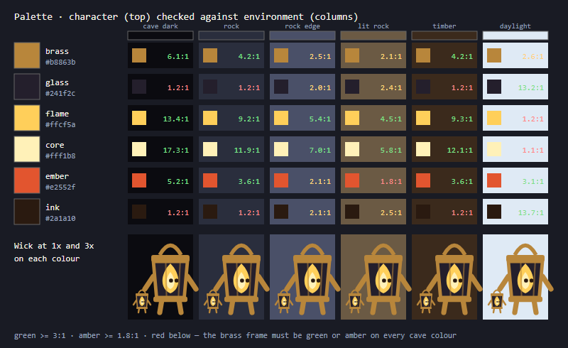

# Character sheet — Wick (v1, 2026-10-03)

- **Concept in one sentence:** Wick is a small brass lantern that walks on two brass legs; the flame inside
  the glass is his face, and its size is how much oil — and light — he has left.
- **Status of these images:** design drawings, written by Claude as SVG
  (`design/character/src/make_character_sheet.py`) before any generation. They are the contract the
  generated pixel sprites must meet; they are not the in-game art.

## Units and in-game size

1 unit = 1 on-screen pixel in the 640×360 viewport. Origin = Wick's feet, horizontally centred.

| Measure | Value |
|---|---|
| Feet to cap top | 27 px |
| Feet to handle top | 32 px |
| Glass width (top / bottom) | 16 / 13 px |
| Cap width | 18 px (= collider width) |
| Eye line | 15 px above the feet |
| **Sprite frame for every state image** | **32 × 40 px**, feet on the bottom row (y = 39), body centred on x = 16 |

## Silhouette at on-screen size

Seven states, solid black, at true 1× size in a 640×360 frame. A 3× nearest-neighbour enlargement of the
same pixels for reading: [silhouette-zoom.png](design/character/silhouette-zoom.png).

**Result:** the handle loop and the box body read as "lantern" even at 1×, and idle / walk / jump / fall /
hurt / celebrate have different silhouettes (arm and leg angles). **Ember has the same silhouette as idle**
— the difference is the flame colour and the size of the engine light, not the outline. That is
acceptable because the ember state also changes the whole screen (tiny light radius, red gauge), but it
means the ember sprite must change colour clearly at 1×.

## Facing / orientation

- **Drawn:** right-facing three-quarter view (the "game view" in the turnaround). The eyes and cage bars
  sit toward the facing side.
- **Flipped at runtime:** left-facing = `Sprite2D.flip_h = true`. The body is symmetric except the eyes and
  bars, which should move with the facing, so a mirror is correct. Not generated separately.
- **Front / side / back** exist only on the turnaround, to lock proportions; the side-view game never shows them.

## Reference — neutral turnaround (counts as one pose)

Front, three-quarter, side, back, at 6×, with a 0–32 px height bar and guide lines at handle top (−32),
collider top (−28), eye line (−15), base (−7) and feet (0). The back view has a latch instead of a face.

## Poses (11 + turnaround = 12, each a single static image for one game state)

| # | Pose | Game state that shows it | In the A2 slice? |
|---|---|---|---|
| 1 | idle | on floor, no input, oil > 0 | yes |
| 2 | bored | idle for more than 4 s — hand on hip, eyes rolled up, flame leaning | optional |
| 3 | walk | on floor, moving | yes |
| 4 | jump (rising) | in air, velocity.y < 0 — arms up, legs tucked | yes |
| 5 | fall | in air, velocity.y ≥ 0 — arms out, legs dangling, flame stretched, eyes wide | yes |
| 6 | land | first ~0.1 s after touching the floor — knees bent, flame squashed | optional |
| 7 | oil pickup | ~0.3 s after touching an oil drop — reaching, flame over the cap, smiling | yes |
| 8 | ember | oil = 0 (any ground state) — flame a small red coal, eyes half closed | yes |
| 9 | hurt / fail | spike or fall death, during the 0.55 s failure window — knocked over, flame blown sideways, X eyes | yes |
| 10 | respawn | first ~0.4 s after returning to a lamp post — small new flame, eyes wide | optional |
| 11 | celebrate | exit reached — arms up, tall flame, happy eyes | yes |
| 12 | turnaround | reference only | — |

Minimum for the slice: idle, walk, jump, fall, pickup, ember, hurt, celebrate (8 images). "Optional"
poses are used if their images pass the consistency check; the game falls back to idle without them.

## Collision overlay

The collider is the `RectangleShape2D` **18 × 28 px** with its bottom centre on the feet, unchanged from
walker-jumpman (whose jump tuning was tested with that size). It covers the glass, the cap and the base.

**Art outside the collider, and why it is fair:**
- **Handle ring** (up to 4 px above), **arms** (up to 6 px to each side) and the **tall flame** in pickup /
  celebrate: decorative. They never cause a hit, so the player can only be hurt by what the box covers
  — a spike that grazes an arm does nothing. That errs in the player's favour.
- **Fall** pose: the dangling feet reach 1 px below the box. The floor is still detected by the box, so
  Wick may appear to sink 1 px into the floor on the first landing frame, which the land pose covers.
- **Hurt** pose is drawn tilted by 10°; part of the body leaves the box. Control is already frozen in
  that state and the collider no longer matters.

## Palette

| Role | Hex |
|---|---|
| brass (frame, cap, base, handle, limbs) | `#b8863b` |
| glass | `#241f2c` |
| flame | `#ffcf5a` |
| flame core | `#fff1b8` |
| ember / hurt flame | `#e2552f` |
| ink (eyes, mouth) | `#2a1a10` |

Checked against six environment colours (WCAG contrast ratio of the brass frame, which carries the
silhouette): cave dark `#0b0b10` **6.1:1**, rock `#2a2e3d` **4.2:1**, timber `#3b2a1c` **4.2:1**,
daylight `#dfeaf5` **2.6:1**, rock edge `#4a5068` **2.5:1**, lit rock `#6b5a44` **2.1:1**.

**Finding:** brass is weakest against lit rock (2.1:1), which is exactly what surrounds Wick inside his
own light. The flame (4.5:1 on lit rock) keeps the centre readable, but the generated environment tiles
must stay darker and bluer than `#6b5a44` where Wick stands, or the frame needs a dark 1 px outline.
This is a prediction to check in the engine (CHANGE-BRIEF failure case). Glass and ink are low-contrast on
dark backgrounds by design: they are interior colours, always surrounded by brass or flame.

## Consistency rules — every generated pose is judged against these

1. **Proportions:** feet-to-cap 27 px, glass 16/13 px wide, cap 18 px wide, at 1× in the 32×40 frame.
   A pose fails if its body is more than 1 px off at game size.
2. **Construction:** handle ring → cap → tapered glass with two bars → base → two brass legs; two brass
   arms attached at the sides of the glass. No extra parts (no hat, no face on the brass, no third leg).
3. **The face lives in the flame.** Two ink eyes on the eye line (−15 px; lower only for squashed /
   ember flames), toward the facing side. Never eyes on the lantern body.
4. **Limbs are brass, 2–3 px thick at 1×, with no hands or feet shapes** beyond a rounded end.
5. **Palette:** only the six colours above (after quantisation). Light glow is **not** baked into the
   sprite — the engine draws the light.
6. **Flame size encodes oil:** full flame inside the glass for normal states; over the cap only in
   pickup and celebrate; ember coal only in ember.
7. **Pixel art:** hard pixel edges, no anti-aliased blur, Godot texture filter = Nearest.
8. **Right-facing three-quarter view** for every gameplay pose.
