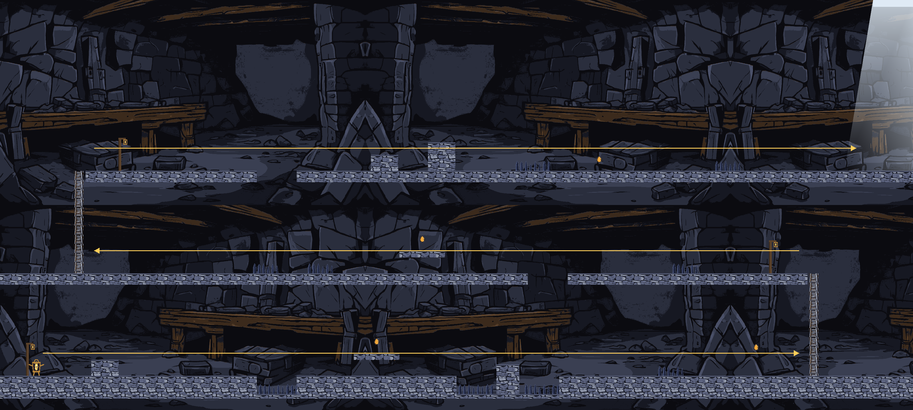

# walker-lamplight-rui-sun

**Lamplight** — CSYE 7270 Fall 2026, Assignment 2 "Generate Art, Sound, and Music for Your Game".

You are **Wick**, a small walking lantern spirit lost in an abandoned mine. Your flame is your life and
your only light: oil drains every second, oil drops refill it, and at zero your ember lasts four seconds.
Climb out through three tunnels to the daylight.



This repository is an **asset slice**: one playable level that proves the generated art, sound effects
and music work together in Godot. It is not the whole game.

## Started from

The Godot project structure (`godot/`) was imported from
[nikbearbrown/walker-jumpman](https://github.com/nikbearbrown/walker-jumpman) at commit `9387542`
(player controller, session state machine, HUD, tests). Only the engine project was copied. Since then
the viewport, tuning, level, art, audio, lighting, HUD and tests have been rebuilt for Lamplight.
Credits and every model's license: [SOURCES.md](SOURCES.md).

## Engine

Godot **4.7.2.stable.official.ed1daf0bf**, GDScript, GL Compatibility renderer, 1280×720 viewport.
Tested on Windows 11 with an RTX 3070 Laptop GPU.

## Run

Open `godot/project.godot` in the Godot 4.7.2 editor and press F5, or from the repository root:

```bash
godot --path godot
```

Tests (headless, all suites; fails on any failed check or script error):

```bash
bash tools/run_tests.sh
```

Asset checks (sprite proportions, colours, in-engine contrast, loop seam numbers; needs Python 3 + Pillow + NumPy):

```bash
python tools/check_assets.py
```

## Controls

| Key | Action |
|---|---|
| Enter | start / resume / play again |
| A / D or ← / → | move |
| Space | jump |
| W / S or ↑ / ↓ | climb a ladder (Down at a ladder's top grabs it) |
| R | back to the last lamp post |
| Esc / P | pause |
| M | main menu (from pause or the end card) |
| **N** | mute / unmute **music** |
| **B** | mute / unmute **effects** |

## What the slice demonstrates

- **Generated character, 9 states:** idle, walk, jump, fall, climb, oil pickup, ember, hurt, celebrate.
  All derive from one SDXL reference and swap as static images; Wick faces left by a runtime flip.
- **Generated environment:** back wall, rock tiles, spikes, oil drops and ladder (SDXL, pixelised to a
  fixed palette). The lamp posts, the exit daylight, the light and the HUD are drawn in code.
- **Four event sounds** (MusicGen): jump, oil pickup, hurt, exit. Each plays once per event and only
  listens to game signals; sound never decides anything.
- **A music loop** (MusicGen, 8 bars at 90 bpm). It gets muffled as the oil drops, dips on death, pauses
  in place and stops at the exit.
- **Readable muted:** every sound has a visual twin; the light ring and the gauge carry the oil.

Design documents: [CONCEPT](CONCEPT.md) · [STORYBOARD](STORYBOARD.md) (hand-drawn) ·
[CHARACTER-SHEET](CHARACTER-SHEET.md) · [CHANGE-BRIEF](CHANGE-BRIEF.md) · [TEST-REPORT](TEST-REPORT.md) ·
[FRICTIONAL](FRICTIONAL.md) · [SOURCES](SOURCES.md) (with the asset log).

## Known limitations

See [TEST-REPORT.md §10](TEST-REPORT.md). In short: the effects are cut from a music model's output;
climb uses a front view instead of a back view; the fall image's eyes are off-centre; the mirrored
background repeat is visible; the outdoor exit scene was not generated; the character-sheet drawings
are SVG while the storyboard is hand-drawn.

## Final film

_TBD — filename, course media storage link, SHA-256._
