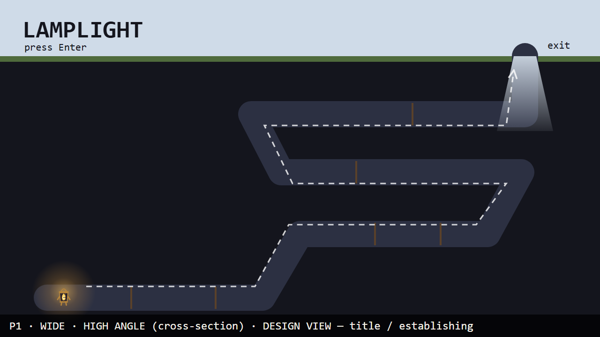
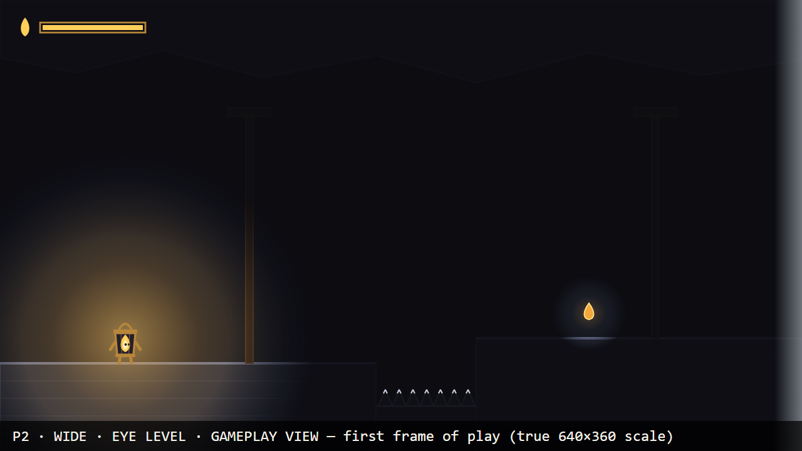
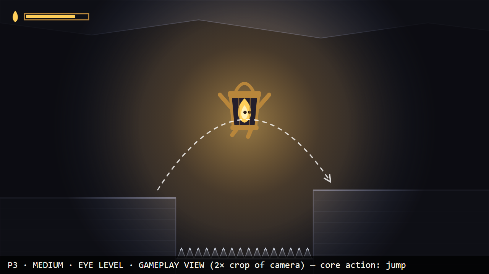
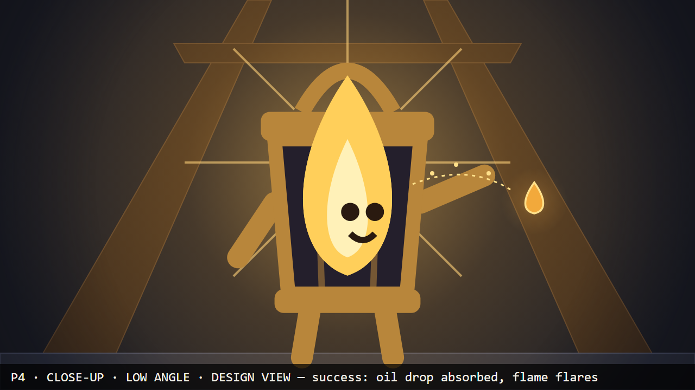
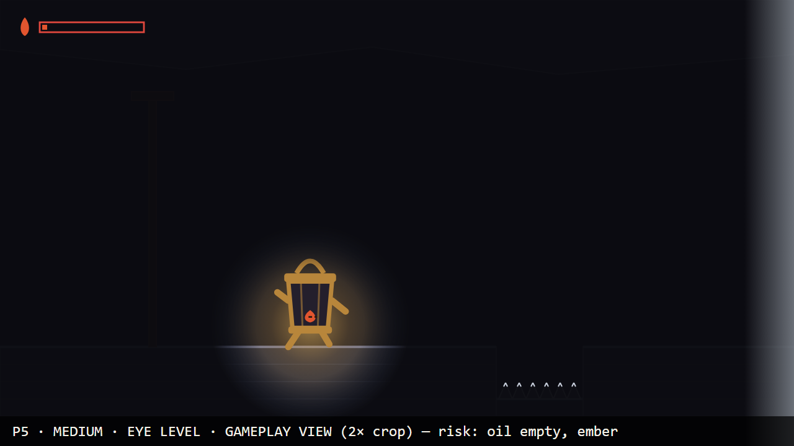
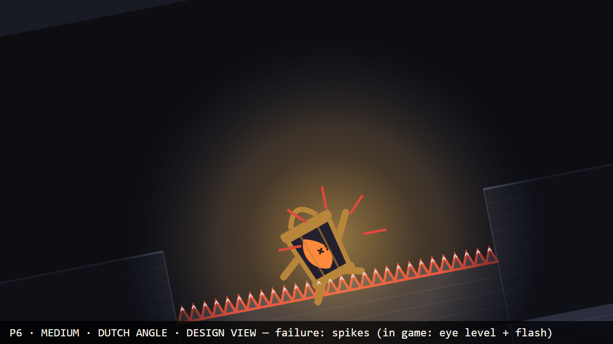
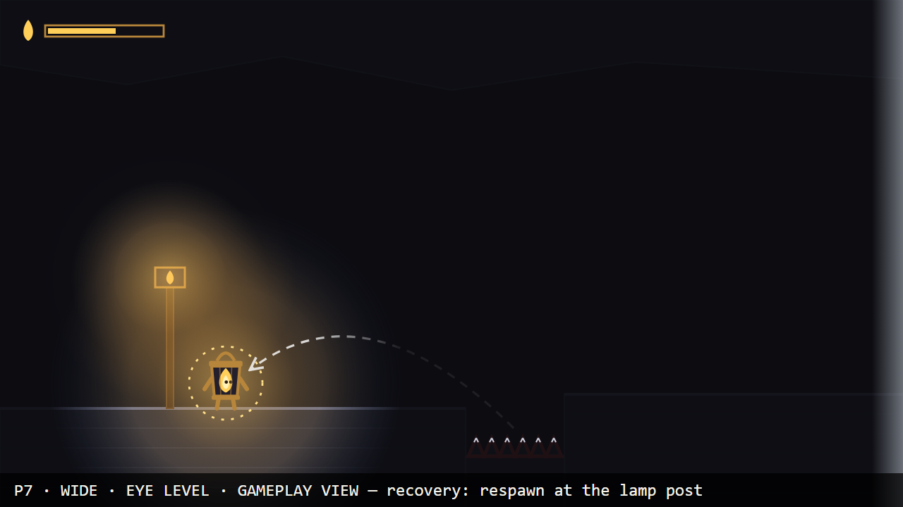
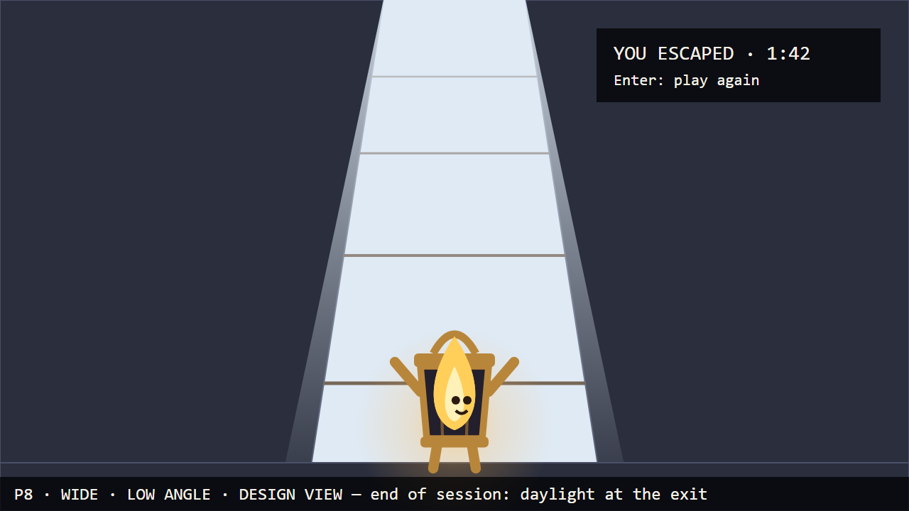

> **Superseded on 2026-10-06 by [STORYBOARD.md](STORYBOARD.md) (v2, hand-drawn).** The instructor
> required hand-drawn storyboards in class. This v1 (Claude-written SVG sketches, commit `96abb60`) is kept
> unchanged below as the record of the first design pass.

# Lamplight — storyboard (v1, 2026-10-03)

Eight panels, in play order, all in one **16:9** frame. The sketches are SVG written by Claude
(`design/storyboard/src/make_storyboard.py`, no generative model) and rasterised to PNG with headless
Chrome. They are the specification the generated assets must meet, not the assets themselves.

**Gameplay view** panels show what the game camera shows: a fixed side view at eye level on a
640×360 viewport. P3 and P5 are marked as 2× crops of that camera so the character can be read in a
thumbnail. **Design view** panels are moments outside normal play (title, end) or shots that fix how a
moment should *feel*; the slice shows those moments at eye level.

## Coverage

| | Panels |
|---|---|
| Views (shot sizes) | wide — P1, P2, P7, P8 · medium — P3, P5, P6 · close-up — P4 |
| Angles | high (cross-section) — P1 · eye level — P2, P3, P5, P7 · low — P4, P8 · Dutch (tilted) — P6 |
| Required moments | first thing seen — P1/P2 · core action — P3 · success — P4 · failure — P6 · recovery — P7 · end of session — P8 |

## Asset IDs used below

Character: `CHAR-IDLE` `CHAR-WALK` `CHAR-JUMP` `CHAR-FALL` `CHAR-EMBER` `CHAR-PICKUP` `CHAR-HURT`
`CHAR-RESPAWN` `CHAR-CELEBRATE` (all derived from `CHAR-REF`) ·
Environment: `ENV-BG` `ENV-TILE` `ENV-TIMBER` `ENV-SPIKE` `ENV-OIL` `ENV-LAMPPOST` `ENV-EXIT` ·
Sound: `SFX-JUMP` `SFX-PICKUP` `SFX-HURT` `SFX-EXIT` · Music: `MUS-LOOP` ·
Code-drawn (not generated): `UI-GAUGE`, `UI-TEXT`, the light radius (a Godot light, not an image).
The full list with the slice/full-game split is in CHANGE-BRIEF.md.

---

## Panel 1 — Title / establishing

- **Shot:** wide · high angle (cross-section of the whole mine) · design view (title screen)
- **Player action:** reads the title and presses Enter; the game starts the run.
- **See:** the mine as a cut-away: zig-zag tunnels, Wick's tiny glow at the bottom left, a shaft of
  daylight at the top right; a dashed route from the glow to the exit.
- **Hear:** `MUS-LOOP` starts at full brightness. No event sound.
- **Assets:** `ENV-BG`, `ENV-EXIT`, `CHAR-IDLE`, `MUS-LOOP`, `UI-TEXT`
- **Design reason (pillar "The way out glows"):** before the first jump the player knows the goal is the
  daylight, and that it is far away.

## Panel 2 — First frame of play

- **Shot:** wide · eye level · gameplay view, drawn at the true 640×360 scale
- **Player action:** none yet; the game spawns Wick at the start lamp post and starts draining oil.
- **See:** `CHAR-IDLE`, small, inside a warm circle of light; almost everything else black. Two things
  read outside the light: the faint glint of spikes in the pit ahead and the halo of an oil drop on the
  far ledge. A pale edge on the right says "exit this way". Oil gauge full.
- **Hear:** `MUS-LOOP` at full brightness.
- **Assets:** `CHAR-IDLE`, `ENV-TILE`, `ENV-TIMBER`, `ENV-SPIKE`, `ENV-OIL`, `ENV-EXIT`, `UI-GAUGE`, `MUS-LOOP`
- **Design reason ("Light is life"):** the first thing the player learns is that they can only see what
  their own flame lights; the oil drop is the second thing.

## Panel 3 — Core action: the jump

- **Shot:** medium · eye level · gameplay view (2× crop of the camera)
- **Player action:** presses Jump at the ledge edge; Wick follows an arc across the spike pit.
- **See:** `CHAR-JUMP` on the way up (`CHAR-FALL` on the way down); the light travels with Wick, so the
  far ledge is revealed as he gets closer. Spike glints below. Gauge at about 80%.
- **Hear:** `SFX-JUMP` once at take-off. Music unchanged.
- **Assets:** `CHAR-JUMP`, `CHAR-FALL`, `ENV-TILE`, `ENV-SPIKE`, `SFX-JUMP`, `UI-GAUGE`
- **Design reason ("Fair in the dark"):** the landing spot is only partly lit when you leave the ground,
  so jumping is a judgment — but the spikes were always visible as glints, so a miss is the player's call.

## Panel 4 — Success: oil drop

- **Shot:** close-up · low angle · design view. In the slice this happens at gameplay scale; the
  close-up fixes what the pickup should *feel* like.
- **Player action:** walks into an oil drop; the game adds oil and widens the light.
- **See:** `CHAR-PICKUP`: Wick reaching for the drop, his flame flaring up above the lantern cap and
  his face happy; the drop streaming into the lantern; light bursting outward.
- **Hear:** `SFX-PICKUP` once. The music's low-pass opens back up toward full brightness.
- **Assets:** `CHAR-PICKUP`, `ENV-OIL`, `ENV-TIMBER`, `SFX-PICKUP`, `MUS-LOOP`
- **Design reason ("Light is life"):** oil is relief you can see and hear — the room literally gets bigger.

## Panel 5 — Risk: the ember

- **Shot:** medium · eye level · gameplay view (2× crop)
- **Player action:** keeps walking with the oil at zero; the game shrinks the light to an ember-sized
  radius but does not end the run.
- **See:** `CHAR-EMBER`: the flame a small red-orange coal, eyes half closed. Light radius tiny. Spike
  glints still visible ahead. Gauge empty and outlined red. The exit edge still pale on the right.
- **Hear:** no event sound. `MUS-LOOP` muffled down to mostly the low pulse.
- **Assets:** `CHAR-EMBER`, `CHAR-WALK`, `ENV-SPIKE`, `ENV-EXIT`, `UI-GAUGE`, `MUS-LOOP`
- **Design reason ("Every second burns" + "Fair in the dark"):** running out is frightening but not
  instantly fatal; the player can still make it if they read the glints.

## Panel 6 — Failure: spikes

- **Shot:** medium · Dutch (tilted) angle · design view. In the slice the camera stays level; the tilt
  fixes the jolt the moment should have, which the slice gives with the hurt pose and the spike flash.
- **Player action:** lands on the spikes; the game freezes control briefly and plays the failure.
- **See:** `CHAR-HURT`: Wick knocked sideways, flame blown to one side, X eyes. The spikes that killed
  him flash red, so the cause is unmistakable.
- **Hear:** `SFX-HURT` once. Music dips (volume duck) during the respawn window.
- **Assets:** `CHAR-HURT`, `ENV-SPIKE`, `SFX-HURT`, `MUS-LOOP`
- **Design reason ("Fair in the dark"):** the player must see exactly what killed them, even muted.

## Panel 7 — Recovery: respawn at the lamp post

- **Shot:** wide · eye level · gameplay view
- **Player action:** none required; the game returns Wick to the last lamp post (dashed arrow) and
  gives control back.
- **See:** `CHAR-RESPAWN` with a short ring of sparks at the lit lamp post; the spikes that killed him
  still flashing in the pit ahead; the gauge refilled to the checkpoint's level, not to full.
- **Hear:** no event sound. Music returns from the dip to the brightness that matches the oil level.
- **Assets:** `CHAR-RESPAWN`, `ENV-LAMPPOST`, `ENV-SPIKE`, `ENV-TILE`, `UI-GAUGE`, `MUS-LOOP`
- **Design reason ("Fair in the dark"):** retry is quick and the lesson (where the pit is) stays on screen.

## Panel 8 — End of session: daylight

- **Shot:** wide · low angle · design view, looking up the exit shaft. In the slice the exit is reached
  at eye level and the same card appears.
- **Player action:** walks into the daylight; the game ends the run and shows the time.
- **See:** `CHAR-CELEBRATE`: arms up, flame full, inside a wide cool-white beam; end card
  "YOU ESCAPED · time · Enter: play again".
- **Hear:** `SFX-EXIT` once; `MUS-LOOP` stops and stays stopped on the end card.
- **Assets:** `CHAR-CELEBRATE`, `ENV-EXIT`, `SFX-EXIT`, `UI-TEXT`
- **Design reason ("The way out glows"):** the only cool light in the game is the reward; silence after
  the music is the relief.
