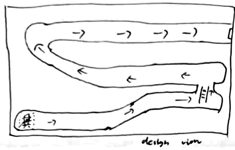
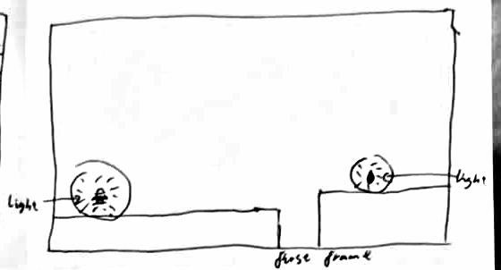
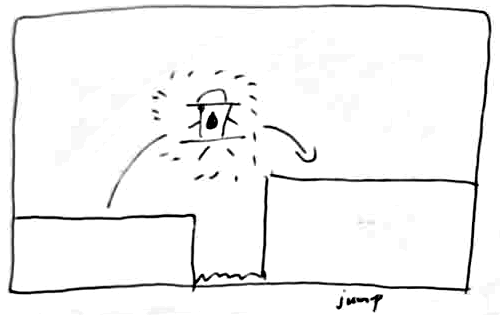
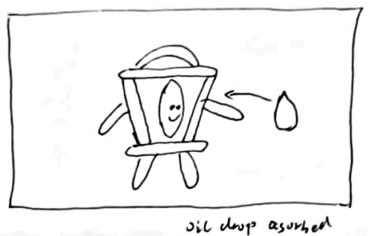
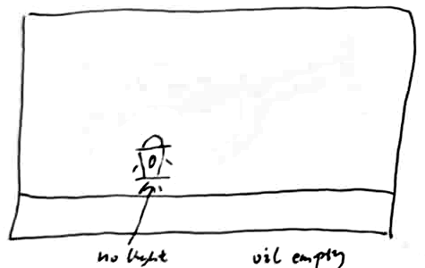
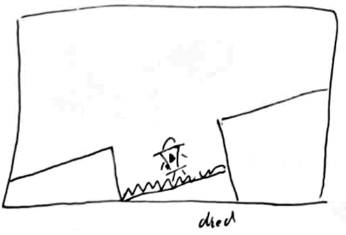
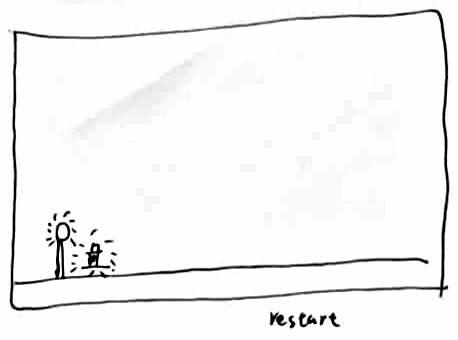
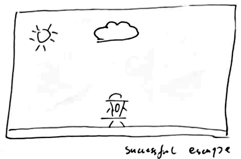

# Lamplight — storyboard (v2, hand-drawn, 2026-10-06)

Eight panels, in play order, **drawn by hand by Rui** on one sheet of paper, all in one 16:9-ish frame.
Original photo: [storyboard-page-photo-2026-10-06.jpg](design/storyboard/hand/storyboard-page-photo-2026-10-06.jpg)
(an earlier photo of the first six panels is kept next to it). The panels were cut out of the photo by
`design/storyboard/hand/crop_panels.py`. The script only crops and evens out the paper shadow; it does
not change any line.

v1 of this storyboard was a set of Claude-written SVG sketches (commit `96abb60`). It is kept as
[STORYBOARD-v1-svg.md](STORYBOARD-v1-svg.md). The instructor said in class that the storyboard must be
hand-drawn, so this hand-drawn v2 replaces it. Where v2 differs from v1, the panel says so.

**Gameplay view** = what the game camera shows: a fixed side view at eye level, 640×360. **Design view**
= a moment outside normal play, or a shot that fixes how a moment should feel.

## Coverage

| | Panels |
|---|---|
| Views (shot sizes) | wide: 1, 2, 5, 7, 8 · medium: 3, 6 · close-up: 4 |
| Angles | high (cross-section): 1 · eye level: 2, 3, 4, 5, 7, 8 · Dutch (tilted): 6 |
| Required moments | first thing seen: 1 / 2 · core action: 3 · success: 4 · failure: 6 · recovery / retry: 7 · end of session: 8 |

Asset IDs match CHANGE-BRIEF.md.

---

## Panel 1 — Design view: the whole route

- **Shot:** wide · high angle (cut-away cross-section of the mine) · design view (title / establishing).
- **Player action:** reads the map and presses Enter to start.
- **See:** Wick's glow at the bottom-left start. Arrows mark the route: right along the bottom tunnel, up
  past a ladder, left along the middle tunnel, round the bend, then right along the top tunnel to the exit
  at the top right.
- **Hear:** `MUS-LOOP` starts at full brightness. No event sound.
- **Assets:** `ENV-BG`, `ENV-EXIT`, `ENV-LADDER`, `CHAR-IDLE`, `CHAR-CLIMB`, `MUS-LOOP`, `UI-TEXT`
- **Design reason (pillar "The way out glows"):** before the first jump the player knows where the exit
  is, and that it is a long way off.
- **Note (Rui, 2026-10-06):** the ladder is in the slice. The slice has a lower and an upper tunnel
  joined by one ladder, so climbing is a verb (`CHAR-CLIMB`, `ENV-LADDER`).

## Panel 2 — First frame of play

- **Shot:** wide · eye level · gameplay view.
- **Player action:** none yet. The game spawns Wick and starts draining oil.
- **See:** `CHAR-IDLE` on the left ledge inside his circle of light. A gap, then a higher ledge with an
  oil drop in its own small glow (both circles are labelled "light"). Everything else is dark.
- **Hear:** `MUS-LOOP` at full brightness.
- **Assets:** `CHAR-IDLE`, `ENV-TILE`, `ENV-OIL`, `UI-GAUGE`, `MUS-LOOP`
- **Design reason ("Light is life"):** the player can only see what their own flame lights, and the
  second light on screen is the oil they need.

## Panel 3 — Core action: the jump

- **Shot:** medium · eye level · gameplay view (closer than the real camera so Wick can be read).
- **Player action:** presses Jump at the ledge edge. Wick follows the arc over the pit onto the higher
  ledge.
- **See:** `CHAR-JUMP` in mid-air with the light moving with him. Spikes at the bottom of the pit.
- **Hear:** `SFX-JUMP` once at take-off. Music unchanged.
- **Assets:** `CHAR-JUMP`, `CHAR-FALL`, `ENV-TILE`, `ENV-SPIKE`, `SFX-JUMP`
- **Design reason ("Fair in the dark"):** the jump is a judgment over a hazard the player can see.

## Panel 4 — Success: oil drop absorbed

- **Shot:** close-up · eye level · design view. In the slice this happens at gameplay scale; the close-up
  fixes what the pickup should feel like.
- **Player action:** walks into an oil drop. The game adds oil and widens the light.
- **See:** `CHAR-PICKUP`: Wick with both arms out and a smiling flame face. The drop flies into the
  lantern along the arrow.
- **Hear:** `SFX-PICKUP` once. The music's muffling opens back up.
- **Assets:** `CHAR-PICKUP`, `ENV-OIL`, `SFX-PICKUP`, `MUS-LOOP`
- **Design reason ("Light is life"):** oil is relief you can see and hear.
- **Change from v1:** drawn at eye level, not low angle.

## Panel 5 — Risk: oil empty

- **Shot:** wide · eye level · gameplay view.
- **Player action:** keeps walking with the oil at zero. The run does not end.
- **See:** `CHAR-EMBER`: Wick small on an empty floor with no light around him ("no light").
- **Hear:** no event sound. `MUS-LOOP` muffled down to mostly the low pulse.
- **Assets:** `CHAR-EMBER`, `CHAR-WALK`, `ENV-TILE`, `UI-GAUGE`, `MUS-LOOP`
- **Design reason ("Every second burns"):** running out is frightening but not instantly fatal.
- **Decided (Rui, 2026-10-06):** "no light" in the sketch means no light beyond Wick himself. A very small
  ring of light stays around his body, so nearby hazards are still faintly readable ("Fair in the dark").

## Panel 6 — Failure: died on the spikes

- **Shot:** medium · Dutch (tilted) angle · design view. The ground lines are drawn tilted. In the slice
  the camera stays level and the jolt comes from the hurt pose and the spike flash.
- **Player action:** misses the jump and lands in the spike pit. The game freezes control for the
  0.55 s failure window.
- **See:** `CHAR-HURT` in the pit among the spikes, between two ledges.
- **Hear:** `SFX-HURT` once. Music dips.
- **Assets:** `CHAR-HURT`, `ENV-SPIKE`, `ENV-TILE`, `SFX-HURT`, `MUS-LOOP`
- **Design reason ("Fair in the dark"):** the player must see exactly what killed them, even muted.

## Panel 7 — Recovery: restart at the lamp post

- **Shot:** wide · eye level · gameplay view.
- **Player action:** none required. The game puts Wick back at the last lamp post and gives control back.
- **See:** the lit lamp post on the left, and `CHAR-RESPAWN` next to it with sparks around him.
- **Hear:** no event sound. Music comes back from the dip.
- **Assets:** `CHAR-RESPAWN`, `ENV-LAMPPOST`, `ENV-TILE`, `MUS-LOOP`
- **Design reason ("Fair in the dark"):** a quick retry from a clearly marked safe place.

## Panel 8 — End of session: successful escape

- **Shot:** wide · eye level · design view (the end screen).
- **Player action:** walks out of the exit. The game ends the run.
- **See:** `CHAR-CELEBRATE` standing outside under an open sky with a sun and a cloud.
- **Hear:** `SFX-EXIT` once. `MUS-LOOP` stops and stays stopped.
- **Assets:** `CHAR-CELEBRATE`, `ENV-EXIT`, `SFX-EXIT`, `UI-TEXT`
- **Design reason ("The way out glows"):** after a whole run in the dark, the reward is daylight and
  open space.
- **Change from v1:** the ending is outdoors (sun, cloud, open ground) rather than looking up a shaft of
  light. `ENV-EXIT` becomes an outdoor daylight scene.
