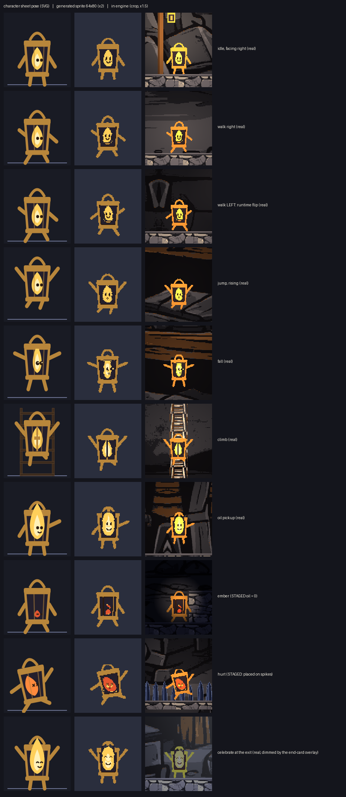
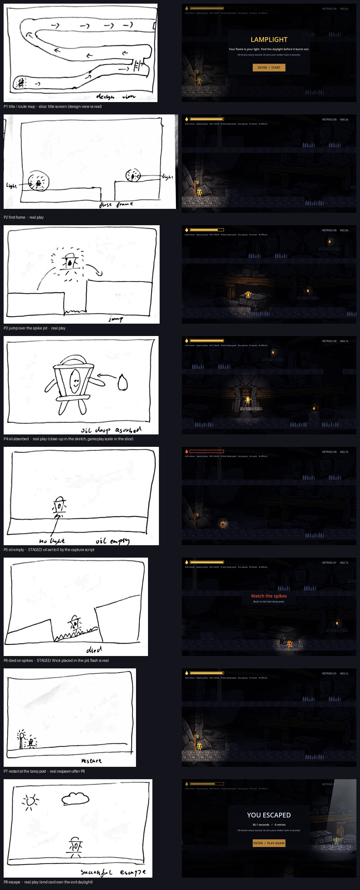

# Test report — Lamplight asset slice

- **Source revision tested:** `77d0573` (game code and assets). The evidence tools in this report
  (`godot/tests/capture_evidence.gd`, `tools/check_assets.py`) were added in the commit that adds this
  file and do not change the game.
- **Engine:** Godot 4.7.2.stable.official.ed1daf0bf (portable), GL Compatibility renderer.
- **Machine:** Windows 11 Home (China), NVIDIA GeForce RTX 3070 Laptop GPU (driver 572.16), 32 GB RAM.
- **Date:** 2026-10-07.
- **Who did what:** Rui played and listened in six sessions (every human result below is Rui's, quoted); Claude wrote
  the code, the automated checks and this report; no other person playtested.

## 1. Startup and controls

| Check | Result |
|---|---|
| Fresh copy | `git clone` of the repo at `77d0573` into `F:\7270\a2-freshcopy` (no `.godot` cache): `godot --headless --path godot --import` exit 0, 20 resources imported (15 PNG, 5 OGG); all five suites pass from the fresh copy (section 7). |
| Runs on Rui's machine | Launched by Claude five times (after steps 3, 4 and 5, for level v2, and for the final volume check). Rui played each one, and the logs show no errors or warnings. |
| Controls | Enter start · A/D or ←/→ move · Space jump · W/S or ↑/↓ climb · R back to last lamp post · Esc/P pause · M menu (from pause / end card) · **N mute music · B mute effects**. Keyboard path covered by `test_keyboard.gd` (synthetic key events). |
| Known engine message | On 2026-10-07 one `--import` run ended with a segmentation fault *after* importing (step 1). The import was complete, and the fresh-copy import did not crash. It looks like a headless-exit issue in Godot 4.7.2, not in the project. Recorded, not fixed. |

## 2. Character against the sheet



Columns: character-sheet pose (Claude SVG) → generated sprite (64×80) → engine capture. Captures are
from `godot/tests/capture_evidence.gd` (`--fixed-fps 60`, real route inputs). **Two are staged:** the
ember image (the script set oil to 0) and the hurt image (the script placed Wick on the spikes; the
death itself is the real rule).

| State | Seen in engine | Matches the sheet? |
|---|---|---|
| idle, walk (right) | yes | yes; flame face in the flame, two eyes (rule 3) |
| walk **left** | yes, runtime flip | yes; Rui (playtest 1): "the flip is fine" |
| jump / fall | yes | jump yes; **fall: eyes sit at the flame's right edge** (accepted by Rui as a known flaw) |
| climb | yes | **front view with a faceless flame stands in for the back view**: the model drew no back view in 4 tries. Not flipped. |
| pickup / celebrate | yes | yes; flame rises through the cap as the sheet allows |
| ember (staged) | yes | yes; reads by colour and light ring, as the silhouette test predicted |
| hurt (staged) | yes | yes; tilted, red flame, X eyes |

**Collision shape:** 36×56 collider (×2 of the inherited 18×28). Arms, handle and the tall flame stand
outside it and never cause a hit (CHARACTER-SHEET). The ladder needed a 3 px gap to the slab: flush,
the collider's edge caught the slab and Wick stuck under it (found by `test_wick`).

## 3. Storyboard against the slice



| Panel | Slice moment | Differences, and why |
|---|---|---|
| P1 route map | title screen | The slice has no in-game map; the title screen plays the role. The level v2 route follows this sketch (bottom → middle-left → top). Map: `design/level-v2-overview.png`. |
| P2 first frame | real | As drawn: Wick lit at the start, the next light (lamp/oil) in the dark. |
| P3 jump | real | Sketch is a medium shot; the slice camera is wider. |
| P4 oil absorbed | real | Close-up in the sketch; gameplay scale in the slice (pickup image, gauge rises, light opens). |
| P5 oil empty | **staged** | Sketch shows "no light"; per Rui (2026-10-06) a small ring remains. Since playtest 2 the ember also burns out after 4 s. |
| P6 died | **staged** position, real flash | Sketch is a Dutch angle; the slice camera stays level. The jolt comes from the hurt image and the red spike flash. |
| P7 restart | real | Respawn at the lamp post, as drawn. |
| P8 escape | real | Sketch shows sun and cloud outdoors. The slice ends in code-drawn daylight plus the end card. **The outdoor scene (ENV-EXIT) was not generated** (a "want" item, left open). |

## 4. Sound events — one sound per occurrence (F3)

`test_audio.gd` counts every `AudioStreamPlayer.play()` call and compares it with the game's own
event counts:

| Event | Sound | Check | Result |
|---|---|---|---|
| jump start (`player.gd` jump line) | SFX-JUMP | 3 jumps + Space held through landings + 12 rapid presses: sounds = jumps (5/5) | PASS |
| jump off a ladder, mashing Space | SFX-JUMP | 1 jump, 1 sound | PASS |
| oil drop collected | SFX-PICKUP | standing on the spot 90 ticks after: still 1 | PASS |
| death (spikes / fall / ember) | SFX-HURT | duplicate fatal call ignored; spikes + ember burn-out in the same tick = 1; again after respawn = 2 | PASS |
| exit reached | SFX-EXIT | standing in the exit 90 ticks: 1; Enter on the end card: no exit sound | PASS |

**Rui's listening:** jump was too loud twice (−8 dB, then −16 dB); at −16 dB: "没问题了" (no problem
now). Rui chose each sound by ear before it went into the engine (SOURCES.md).

## 5. Music

| Behaviour (CHANGE-BRIEF 3) | Automated | Human |
|---|---|---|
| Loop repeats cleanly | stream `loop = true`; cut at 8 bars of a measured 90 bpm, seam sample jump 0.0020 vs median step 0.0006 | Rui, standalone 3× repeat: b1 "no problem at the seam" (b0 rejected for "a slight problem"). **In engine (playtest 6): "没有断拍" (no broken beat).** |
| Pause / resume in place | PASS | — |
| Dip on death, return after respawn | PASS (−9.9 dB at 8 ticks, 0 dB after) | — |
| Muffles with low oil; ember = mostly pulse, −4 dB | PASS (cutoff 1918 Hz at 20 oil, 452 Hz at 0) | **F7, Rui (playtest 6): "音乐有一点区别" (the music has a little difference).** Audible but subtle; the playback device was not stated. |
| Stops at the exit, restarts on a new run | PASS | Rui heard the exit (playtests 3–5) |
| N / B mute music / effects separately | PASS | — |

## 6. Muted play

- **Automated (F5):** the full real-input route was run with sound on and with both buses muted. The
  traces were compared every 10 ticks (position, state, deaths, oil) and were identical (179 samples, same
  end: 1784 ticks, 0 deaths, 17 jumps, 6 drops). PASS.
- **Every sound has a visual twin** (CHANGE-BRIEF 5): jump image, pickup image + gauge + light, hurt
  image + red spike flash + message, celebrate + end card; the ember warning is the shrinking ring and the
  faster blinking gauge.
- **Human muted playtest (Rui, playtest 6, music and effects muted with N and B):** "静音时没问题"
  (no problem when muted). Rui could follow the game without sound.

## 7. Automated checks

```bash
bash tools/run_tests.sh
python tools/check_assets.py
```

`run_tests.sh` runs every suite at `--fixed-fps 60` and fails a suite on any failed check, any SCRIPT
ERROR, a non-zero exit or zero passes. Receipts: `evidence/runs/*.json`.

| Suite | Checks | Result (twice in a row, and from the fresh copy) |
|---|---|---|
| test_game (movement, jump tuning, coyote/buffer, pause, spikes, respawn, **full real-input route through all three tunnels**, exit) | 26 | 0 failures |
| test_keyboard (synthetic key events) | 9 | 0 failures |
| test_wick (state images, anchoring, facing, ladder F8) | 17 | 0 failures |
| test_oil (drain, pickup, light radius, ember burn-out, lamp posts) | 24 | 0 failures |
| test_audio (F3 counts, music behaviour, mute keys, F5) | 23 | 0 failures |
| check_assets.py (F1 proportions, F6 colours/filter, F2 in-engine contrast, F4 seam numbers) | 31 rows | 0 FAIL, 2 NOTE |

Test problems found and fixed honestly, never by weakening an assertion:
- **A compile error printed "0 failures"** (step 5). Godot kept running after a script failed to load,
  so the runner now treats SCRIPT ERROR as a failure.
- **The F5 trace check flaked.** The cause was not sound: a fast headless run decides from real time
  how many physics ticks fit in a frame (one run was one oil tick ahead). Fixed with `--fixed-fps 60`.
  The comparison was not loosened.
- **Four of my own test mistakes** were corrected to measure the right moment: the fall image checked
  before the apex; "starts full" checked after drain began (now an exact formula); oil at respawn
  sampled 6 ticks late (now at the respawn signal); a `str(100.0)` key that hung the run. Each fix made
  the check stricter or equal.

## 8. Predicted failures (CHANGE-BRIEF 6) — what actually happened

| # | Prediction | Outcome |
|---|---|---|
| F1 | poses drift from the reference | Prevented by deriving every pose with the CHAR-REF seed/prompt and one fixed scale; 7/9 within ±2 px; pickup/celebrate not measurable by design (NOTE). |
| F2 | Wick disappears against lit rock (2.1:1 on the sheet) | **Did not happen in the engine:** 4.8–9.6:1 measured on captures. The warm light lifts the brass and the generated rock is dark and cold. |
| F3 | a sound fires twice | PASS in all scripted cases. |
| F4 | loop clicks at the seam | Numbers clean; Rui's standalone listening fine for b1. b0 *did* have an audible seam problem that the numbers missed, so b1 was chosen. |
| F5 | muting changes the game / unreadable muted | Automated PASS (identical traces); Rui's muted playtest: "no problem". |
| F6 | generated pixel art not on a grid | Happened (SDXL "pixel art" was soft, extra colours). Solved by illustrate-then-pixelise; 5 colours per sprite, no semi-transparency, Nearest. |
| F7 | muffling too subtle | **Partly happened:** Rui hears "a little difference". The pass condition (distinguishable) is met, but only just. The planned fallback (add the −4 dB step earlier, or a deeper cutoff) was not applied; it is listed as a limitation. |
| F8 | the ladder breaks movement | Happened twice (stuck under the slab; up-and-down loop at the top) and once for Rui ("coming down feels stuck"); all fixed and covered. |

## 9. Human playtests (Rui), and the revisions they caused

| # | Build | Rui's words | Revision |
|---|---|---|---|
| 1 | step 3 | "翻转没问题，从梯子上下来的时候感觉有点卡" (flip is fine; coming down the ladder feels a bit stuck) | grab the ladder from the top with Down; descend 1.5× faster (`b72a749`) |
| 2 | step 4 | "还能继续玩下去，黑暗状态下能够看到尖刺……风险不够" (you can keep playing; spikes are visible in the dark; the risk is not enough) | ember burns out at zero oil; drain 4 → 6/s (`0295499`) |
| 3 | step 5, first with sound | "跳跃的声音太大了……地图能够更加复杂一点，更长一点……余烬时间减到四秒" (jump too loud; map more complex and longer; ember 4 s) | jump −8 dB; level v2 (three tunnels from Rui's storyboard P1); ember 4 s (`d195a92`) |
| 4 | level v2 | "跳跃的声音还是大，其他部分没有什么问题，油有点少" (jump still loud; the rest fine; oil a bit scarce) | jump −16 dB; two more oil drops on the route (`77d0573`) |
| 5 | final volume | "没问题了" (no problem now) | — |
| 6 | muted, then music on | "静音时没问题，音乐有一点区别，没有断拍" (fine when muted; the music has a little difference; no broken beat) | none; F7 recorded as subtle |

Inspect-and-revise cycles driven by observation (details in FRICTIONAL.md): CHAR-REF rounds 1–3 and
the switch to illustrate-then-pixelise; the 32×40 → 64×80 size change after a measured reduction showed
the face dissolving; hurt regenerated with a red flame after its orange quantised to brass; the back
wall darkened after a composite mock; ambient light raised after screenshots hid the ledges; the five
playtest revisions above.

## 10. Honest limitations

- **The oil-to-music muffling is subtle** (Rui: "a little difference"; F7). It is the main audio signal of
  "Every second burns"; a stronger curve is the first audio change for the full game.
- MusicGen is a music model; the effects are short cuts of musical textures rather than designed one-shots.
- **Found while capturing the film (2026-10-07):** driven through real `Input` (one tick later than the
  test hooks), chaining the jump between the middle tunnel's two spike strips at full speed needs
  near-frame-perfect timing; landing there leaves ~9–15 px before the next strip. Rui completed it in play
  (probably by stopping in the gap). The route mark moved 1237 → 1262 for the film; the gap itself is
  unchanged and is the first level change for the full game.
- Climb uses a front view standing in for the back view; the fall image's eyes are off-centre.
- The mirrored repeat of the generated back wall is visible as symmetric crates/pillars where the light reaches.
- Lamp posts, the exit daylight, the HUD and the light are code-drawn; the outdoor exit scene (P8 sun and cloud) was not made.
- The character sheet drawings are Claude's SVG (Rui's choice). The instructor's hand-drawn rule may
  cover them; the storyboard was redrawn by hand.
- No animation: each state is one static image swapped in (allowed by the brief).
